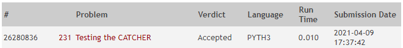

**Autor:** Renan Costa Nascimento

**Data:** 09 de março de 2021

**Problema:** 00231 -- Testing the CATCHER
## Descrição
A ideia da solução é responder a seguinte pergunta: se eu interceptar o míssil na posição `n`, que outros mísseis que sobraram eu também vou conseguir interceptar? Para isso, o algoritmo escolhe o primeiro míssil e refaz a mesma pergunta para os demais mísseis até que a lista de mísseis que sobram acabe. Quando isso acontecer, chegamos ao caso base. Como cada míssel pode ser capturado mais de uma vez em soluções diferentes, cada míssel capturado é guardado em um cache e consultado quando necessário, ou seja, antes de calcular o valor novamente. 

O problema foi desenvolvido em Python 3 e recebeu o veredito "Accepted" no Online Judge, como mostrado na figura abaixo:

## Análise de Complexidade
O método `solve` da classe `TestCase` é utilizado para resolver o problema. Ele itera sobre todos os mísseis e, para cada um, chama a função `interceptMissile` passando o index desse míssel. Esse método vai então permutar o míssel escolhido com todos os outros que sobraram para ver qual pode ser interceptado também. Essa operação é realizada recursivamente chamando o `interceptMissile` novamente, mas dessa vez passando o primeiro da lista dos que sobraram. Eventualmente o míssel escolhido será o último da lista, e o método retorna 1 (apenas um míssel pode ser interceptado). Cada vez que a solução de `interceptMissile` é encontrado, o valor é salvo em cache. Com base nisso, a complexidade de `interceptMissile` pode ser definida conforme abaixo:

T(n) = 
- O(6), se o tamanho da lista de mísseis for 1 `O(6) se refere à chamadas de funções, comparações, atribuições, etc`
- O(6) + O(n²), caso contrário