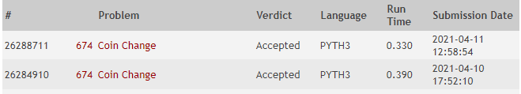

**Autor:** Renan Costa Nascimento

**Data:** 11 de março de 2021

**Problema:** 00674 -- Coin Change
## Descrição
A ideia da solução é manter uma matrix com todos os possíveis trocos com todas as moedas. Cada linha representa uma moeda, e cada coluna representa uma quantia em centavos. A interseção de uma linha `i` com uma coluna `j` responde: de quantas maneiras é possível dar troco de `j` usando as primeiras `i` moedas? A matrix contém uma linha e coluna extra representando respectivamente 0 moedas e 0 centavos. Toda a primeira coluna é iniciada com o valor 1, ou seja, há apenas uma maneira de dar troco para 0 usando qualquer número de moedas.

O problema foi desenvolvido em Python 3 e recebeu o veredito "Accepted" no Online Judge, como mostrado na figura abaixo:

## Análise de Complexidade
O método `solve` da classe `TestCase` é utilizado para resolver o problema. A solução é composta de duas etapas. A primeira ocorre através de do método `__addMissingValues`. Esse método vai preencher a matrix de trocos `changes` com zeros para cada centavo que ainda não foi calculado. A segunda etapa de fato calcula de quantas formas é possível dar o troco usando cada uma das moedas disponíveis (5 moedas). Esse cálculo sempre é feito usando resultados anteriores. Então se eu quiser saber de quantas formas consigo dar `x` de troco usando as 5 moedas, eu preciso saber...
- de quantas formas eu consigo dar `x` de troco usando 4 moedas
- de quantas formas eu consigo dar `x - valor_da_moeda` de troco usando 5 moedas

... e assim sucessivamente.

Com base nisso, a complexidade de `solve` pode ser definida conforme abaixo:

T(n) = 
- O(8), se `n` (a quantidade de centavos) for igual a zero ou for menor do que o maior valor de `n` calculado
- O(3) + 5 O(n), caso contrário