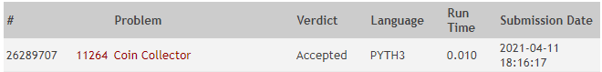

**Autor:** Renan Costa Nascimento

**Data:** 11 de março de 2021

**Problema:** 11264 -- Coin Collector
## Descrição
A ideia da solução é percorrer todas as moedas para montar a quantia `amount` que deve ser retirada. Uma moeda só vai ser adicionada a quantia em três casos:

- ela é a primeira moeda, nesse caso faz sentido ela sempre entrar
- ela é a última moeda, pelo mesmo motivo
- a quantia atual mais o valor da moeda atual seja inferior ao valor na moeda seguinte

O terceiro bullet point é a característica gulosa que o algoritmo usa pra escolher a quantia exata. A ideia por trás disso é que se a soma da quantia com a moeda atual for maior do que o valor da próxima moeda e eu adicioná-la mesmo assim, estarei dando margem para que uma mesma moeda seja escolhida mais de uma vez no saque. Ou seja, adicionar essa moeda elimina a chance da próxima moeda de ser adicionada na quantia. Como queremos o maior número de moedas distintas, descartamos a moeda atual sem precisar analisar os casos em que ela é adicionada na quantia. Após a quantia ser calculada, aplicamos o algoritmo de saque apresentado no problema e contamos a quantidade de moedas únicas.

O problema foi desenvolvido em Python 3 e recebeu o veredito "Accepted" no Online Judge, como mostrado na figura abaixo:

## Análise de Complexidade
O método `solve` da classe `TestCase` é utilizado para resolver o problema. A solução ocorre em duas etapas: calcular a quantia e retirar a quantia calculada. A primeira etapa ocorre em `O(n)` onde `n` é o número de moedas (precisamos percorrer todas). A segunda etapa é basicamente uma busca binária (método `__findHighestCoinLowerThan`) para achar a maior moeda menor do que a quantia calculada, ocorrendo em `O(log n)`.

Com base nisso, a complexidade de `solve` pode ser definida conforme abaixo:

T(n) = 
- O(5) + O(log n), se `n` for igual a 1
- O(5) + n O(log n), caso contrário